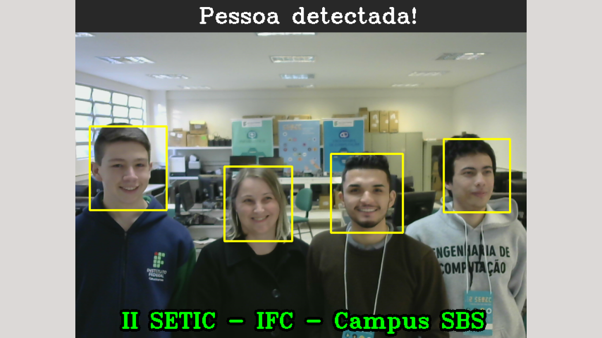

# Face Detector



> Face detector developed using OpenCV for a brazilian technological event at IFC São Bento do Sul — Federal Institute in the South of Brazil.

### Requirements:

* Webcam

### Dependencies:

* OpenCV

```
pip install opencv-python
```

### Run main.py

```
py main.py
```

Press "e" to finish execution.

> Note that "II SETIC - IFC - Campus SBS" won't appear when you run. That's because it's just a label with the event name. But you can uncomment these rows to see how it works and change them to whatever you want.
